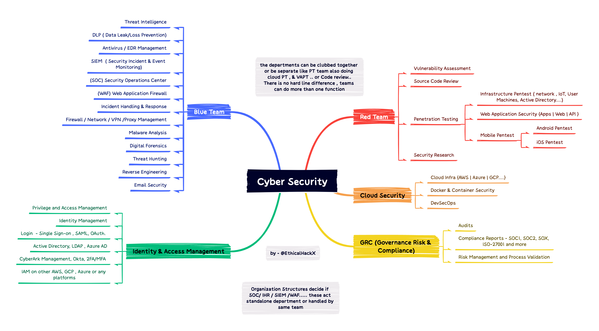

# Security Interview Study Notes

### Contents
- [README](README.md)
- [Learning Tips](#learning-tips)
- [Interviewing Tips](#interviewing-tips)
- [Networking](#networking)
- [Web Application](#web-application)
- [Infrastructure (Prod / Cloud) Virtualisation](#infrastructure-prod--cloud-virtualisation)
- [OS Implementation and Systems](#os-implementation-and-systems)
- [Mitigations](#mitigations)
- [Cryptography, Authentication, Identity](#cryptography-authentication-identity)
- [Malware & Reversing](#malware--reversing)
- [Exploits](#exploits)
- [Attack Structure](#attack-structure)
- [Threat Modeling](#threat-modeling)
- [Detection](#detection)
- [Digital Forensics](#digital-forensics)
- [Incident Management](#incident-management)
- [Coding & Algorithms](#coding--algorithms)
- [Security Themed Coding Challenges](#security-themed-coding-challenges)
- [Cyber_Security_Interview_Questions](#cyber_security_interview_questions)

# Cyber Secuirty Job Roles

# To-Do
- [ ] Add answers to questions
- [ ] Categorize the questions and answers
- [ ] Add cheatsheet and images
- [ ] Add books and categorize the basic data

# Learning Tips 

- [Summary on how to learn](https://medium.com/learn-love-code/learnings-from-learning-how-to-learn-19d149920dc4) on Medium.

- **Track concepts - "To learn", "Revising", "Done"**
	- Any terms I couldn't easily explain went on to post-its. 
	- One term per post-it. 
	- "To learn", "Revising", "Done" was written on my whiteboard and I moved my post-its between these categories, I attended to this every few days.
	- I looked up terms everyday, and I practiced recalling terms and explaining them to myself every time I remembered I had these interviews coming up (frequently).
	- I focused on the most difficult topics first before moving onto easier topics.
	- I carried around a notebook and wrote down terms and explanations. 
	- Using paper reduces distractions.

- **How to review concepts**
	- Use spaced-repetition.
	- Don't immediately look up the answer, EVEN IF you have never seen the term before. Ask yourself what the term means. Guess the answer. Then look it up.
	- Review terms *all the time*. You can review items in your head at any time. If I was struggling to fall asleep, I'd go through terms in my head and explained them to myself. 100% success rate of falling asleep in less than 10 minutes, works every time. 

- **Target your learning**
	- Think *hard* about what specific team you are going for, what skills do they want? If you aren't sure, then ask someone who will definitely know.
	- Always focus on the areas you struggle with the most *first* in a study session. Then move on to easier or more familiar topics. 

- **Identify what you need to work on** 
	- Spend more time doing the difficult things.
	- If you're weak on coding and you find yourself avoiding it, then spend most of your study time doing that.

- **Read**
	- Read relevant books (you don't have to read back to back).
	- When looking up things online, avoid going more than two referral links deep - this will save you from browser tab hell.

- **Mental health**
	- Take care of your basic needs first - sleep, eat well, drink water, gentle exercise. You know yourself, so do what's best for you.
	- You are more than your economic output, remember to separate your self worth from your paycheque. 
	- See interviews for what they are - they are *not* a measure of you being "good enough".

# Interviewing Tips 

- **Interview questions**
	- Interview questions are intentionally vague. This is to encourage questions.
	- Ask clarifying questions 
	- Questions reveal how you approach problems.
	- Write down notes about the question. This is so you don't forget details and only partially answer, or give the wrong answer.
	- Interviews should be more like a conversation with a lot of back and forth, thoroughly explore scenarios together and avoid jumping too fast to a solution.
	- The interviewer can only make an evaluation on your suitability for the job based on the things you *say*. 
	- **Interviewers test depth of knowledge**
		- There will be questions about technical details on topics to the point where it'll be hard to answer. This is okay, try your best to work through it and say what you're thinking.
		- Interviewers often aren't looking for specific answers, they just want to see how deeply you know a topic.
		- Approach the question from a low level and even ask your interviewer if you need to add more details before moving on.
	- **Interviewers test breadth of knowledge**
		- There will be questions related to the role you're applying for and some that aren't. This is to explore breadth of knowledge. 
		- Try your best to explore the scenarios and ask questions. It's very important to say your thinking aloud, you might be on the right track.

- **Show comprehension**
	- Try to always ask clarifying questions even if you think you already know the answer. You might learn some nuance that even improves your idea.
	- Always repeat the question back to the interviewer to both check your understanding and give yourself thinking time.
	- *"Okay, I'll repeat back the question so I can check my understanding…"*
	- *"Just to clarify…"*
	- *"I just want to check I heard correctly…"*
	
- **State your assumptions**
	- Your interviewer will provide feedback if your assumptions are unreasonable.
	- *"I am going to assume that the organisation is collecting x,y,z logs from hosts and storing these for at least 90 days…"* 
	- *"Can I make the assumption that…?"*
	- *"Let's say that we can get x,y,z information…"*

- **When asked a question you're not sure of the answer to right away, try these phrases:**
	- *"I don't know but if I had to invent it, it would be like this…"*
	- *"I don't know that exactly but I know something about a similar subject / sub component…"*
	- *"This is what's popping into my mind right now is…"*
	- *"The only thing that is coming to mind is…"* 
	- *"I know a lot about [similar thing], I could talk about that instead? Would that be okay?"*

- **Say what you are thinking**
	- The interviewer can only make an evaluation on your suitability for the job based on the things you *say*. 
	- If you don't say your thought process aloud, then the interviewer doesn't know what you know. 
	- You may well be on the right track with an answer. You'll be kicking yourself afterwards if you later realise you were but didn't say anything (I missed out on an internship because of this!).
	- Write pseudo code for your coding solution so you don't have to hold everything in your head.
	- *"Right now I am thinking about…"*
	- *"I am thinking about different approaches, for example…"*
	- *"I keep coming back to [subject/idea/thing] but I think that's not the right direction. I am thinking about…"*
	- *"I'm interested in this idea that…"*

- **Reduce cognitive load**
	- Take notes on the question and assumptions during the interview.
	- If the infrastructure is complicated, draw up what you think it looks like. 
	- Write pseudocode. 
	- Write tests and expected output for code you write, test your code against it. 

- **Prepare**
	- Make a checklist that reminds you of what to do for each question, something like:
		- Listen to interview question
		- Take notes on the question
		- Repeat the question
		- Ask clarifying questions
		- State any assumptions
	- Prepare questions that you want to ask your interviewers at the end of the interview so you don't need to think of them on the spot on the day. Since an interview is also for you to know more about the workplace, I asked questions about the worst parts of the job. 
	- Bring some small snacks in a box or container that isn't noisy and distracting. A little bit of sugar throughout the interviews can help your problem solving abilities. 
	- Stay hydrated - and take a toilet break between every interview if you need to (it's good to take a quiet moment).

- **Do practice interviews**
	- Do them until they feel more comfortable and you can easily talk through problems.
	- Ask your friends/peers to give you really hard questions that you definitely don't know how to answer.
	- Practice being in the very uncomfortable position where you have no idea about the topic you've been asked. Work through it from first principles.
	- Practice speaking aloud everything you know about a topic, even details you think might be irrelevant. 
	- Doooo theeeeemmm yes they can be annoying to organise but it is *worth it*.

## Interviewers are potential friends and they want to help you get the job, they are on your side. Let them help you, ask them questions, recite everything you know on a topic and *say your thought process out loud*.

# Networking 

- **OSI Model**
	- Application; layer 7 (and basically layers 5 & 6) (includes API, HTTP, etc).
	- Transport; layer 4 (TCP/UDP).
	- Network; layer 3 (Routing).
	- Datalink; layer 2 (Error checking and frame synchronisation).
	- Physical; layer 1 (Bits over fibre).	
- **Firewalls**
	- Rules to prevent incoming and outgoing connections.	
- **NAT** 
	- Useful to understand IPv4 vs IPv6.
- **DNS**
	- (53)
	- Requests to DNS are usually UDP, unless the server gives a redirect notice asking for a TCP connection. Look up in cache happens first. DNS exfiltration. Using raw IP addresses means no DNS logs, but there are HTTP logs. DNS sinkholes.
	- In a reverse DNS lookup, PTR might contain- 2.152.80.208.in-addr.arpa, which will map to  208.80.152.2. DNS lookups start at the end of the string and work backwards, which is why the IP address is backwards in PTR.
- **DNS** exfiltration 
	- Sending data as subdomains. 
	- 26856485f6476a567567c6576e678.badguy.com
	- Doesn’t show up in http logs. 
- **DNS** configs
	- Start of Authority (SOA).
	- IP addresses (A and AAAA).
	- SMTP mail exchangers (MX).
	- Name servers (NS).
	- Pointers for reverse DNS lookups (PTR).
	- Domain name aliases (CNAME).
- **ARP**
	- Pair MAC address with IP Address for IP connections. 
- **DHCP**
	- UDP (67 - Server, 68 - Client)
	- Dynamic address allocation (allocated by router).
	- `DHCPDISCOVER` -> `DHCPOFFER` -> `DHCPREQUEST` -> `DHCPACK`
- **Multiplex** 
	- Timeshare, statistical share, just useful to know it exists.
- **Traceroute** 
	- Usually uses UDP, but might also use ICMP Echo Request or TCP SYN. TTL, or hop-limit.
	- Initial hop-limit is 128 for windows and 64 for *nix. Destination returns ICMP Echo Reply. 
- **Nmap** 
	- Network scanning tool.
- **Intercepts** (PitM - Person in the middle)
	- Understand PKI (public key infrastructure in relation to this).
- **VPN** 
	- Hide traffic from ISP but expose traffic to VPN provider.
- **Tor** 
	- Traffic is obvious on a network. 
	- How do organised crime investigators find people on tor networks. 
- **Proxy**  
	- Why 7 proxies won’t help you. 
- **BGP**
	- Border Gateway Protocol.
	- Holds the internet together.
- **Network** traffic tools
	- Wireshark
	- Tcpdump
	- Burp suite
- **HTTP**/S 
	- (80, 443)
- **SSL**/TLS
	- (443) 
	- Super important to learn this, includes learning about handshakes, encryption, signing, certificate authorities, trust systems. A good [primer](https://english.ncsc.nl/publications/publications/2021/january/19/it-security-guidelines-for-transport-layer-security-2.1) on all these concepts and algorithms is made available by the Dutch cybersecurity center.
	- POODLE, BEAST, CRIME, BREACH, HEARTBLEED.
- **TCP**/UDP
	- Web traffic, chat, voip, traceroute.
	- TCP will throttle back if packets are lost but UDP doesn't. 
	- Streaming can slow network TCP connections sharing the same network.
- **ICMP** 
	- Ping and traceroute.
- **Mail**
	- SMTP (25, 587, 465)
	- IMAP (143, 993)
	- POP3 (110, 995)
- **SSH** 
	- (22)
	- Handshake uses asymmetric encryption to exchange symmetric key.
- **Telnet**
	- (23, 992)
	- Allows remote communication with hosts.
- **ARP**  
	- Who is 0.0.0.0? Tell 0.0.0.1.
	- Linking IP address to MAC, Looks at cache first.
- **DHCP** 
	- (67, 68) (546, 547)
	- Dynamic (leases IP address, not persistent).
	- Automatic (leases IP address and remembers MAC and IP pairing in a table).
	- Manual (static IP set by administrator).
- **IRC** 
	- Understand use by hackers (botnets).
- **FTP**/**SFTP** 
	- (21, 22)
- **RPC** 
	- Predefined set of tasks that remote clients can execute.
	- Used inside orgs. 
- **Service** ports
	- 0 - 1023: Reserved for common services - sudo required. 
	- 1024 - 49151: Registered ports used for IANA-registered services. 
	- 49152 - 65535: Dynamic ports that can be used for anything. 
- **HTTP Header**
	- | Verb | Path | HTTP version |
	- Domain
	- Accept
	- Accept-language
	- Accept-charset
	- Accept-encoding(compression type)
	- Connection- close or keep-alive
	- Referrer
	- Return address
	- Expected Size?
- **HTTP Response Header**
	- HTTP version
	- Status Codes: 
		- 1xx: Informational Response
		- 2xx: Successful
		- 3xx: Redirection
		- 4xx: Client Error
		- 5xx: Server Error
	- Type of data in response 
	- Type of encoding
	- Language 
	- Charset
- **UDP Header**
	- Source port
	- Destination port
	- Length
	- Checksum
-**Broadcast domains and collision domains.** 
- **Root stores**
- **CAM table overflow**

# Web Application 

- **Same origin policy**
	- Only accept requests from the same origin domain.  
- **CORS** 
	- Cross-Origin Resource Sharing. Can specify allowed origins in HTTP headers. Sends a preflight request with options set asking if the server approves, and if the server approves, then the actual request is sent (eg. should client send auth cookies).
- **HSTS** 
	- Policies, eg what websites use HTTPS.
- **Cert** **transparency** 
	- Can verify certificates against public logs 	
- **HTTP Public Key Pinning**
	- (HPKP)
	- Deprecated by Google Chrome
- **Cookies** 
	- httponly - cannot be accessed by javascript.
- **CSRF**
	- Cross-Site Request Forgery.
	- Cookies.
- **XSS**
	- Reflected XSS.
	- Persistent XSS.
	- DOM based /client-side XSS.
	- `` will often load content from other websites, making a cross-origin HTTP request. 
- **SQLi** 
	- Person-in-the-browser (flash / java applets) (malware).
	- Validation / sanitisation of webforms.
- **POST** 
	- Form data. 
- **GET** 
	- Queries. 
	- Visible from URL.
- **Directory** **traversal** 
	- Find directories on the server you’re not meant to be able to see.
	- There are tools that do this.
- **APIs** 
	- Think about what information they return. 
	- And what can be sent.
- **Beefhook**
	- Get info about Chrome extensions.
- **User agents**
	- Is this a legitimate browser? Or a botnet?
- **Browser extension take-overs**
	- Miners, cred stealers, adware.
- **Local file inclusion**
- **Remote file inclusion (not as common these days)**
- **SSRF** 
	- Server Side Request Forgery.
- **Web vuln scanners. **
- **SQLmap.**
- **Malicious redirects.**

# Infrastructure (Prod / Cloud) Virtualisation 

- **Hypervisors**.
- **Hyperjacking**.
- **Containers, VMs, clusters.**
- **Escaping techniques.**
	- Network connections from VMs / containers.  
- **Lateral movement and privilege escalation techniques.**
	- Cloud Service Accounts can be used for lateral movement and privilege escalation in Cloud environments.
	- GCPloit tool for Google Cloud Projects.
- **Site isolation.**
- **Side-channel attacks.**
	- Spectre, Meltdown.
- **Beyondcorp** 
	- Trusting the host but not the network.
- **Log4j vuln. **

# OS Implementation and Systems

- Privilege escalation techniques, and prevention.
- Buffer Overflows.
- Directory traversal (prevention).
- Remote Code Execution / getting shells.
- Local databases
	- Some messaging apps use sqlite for storing messages.
	- Useful for digital forensics, especially on phones.
- Windows
	- Windows registry and group policy.
	- Active Directory (AD).
		- Bloodhound tool. 
		- Kerberos authentication with AD.
	- Windows SMB. 
	- Samba (with SMB).
	- Buffer Overflows. 
	- ROP. 
	
- *nix 
	- SELinux.
	- Kernel, userspace, permissions.
	- MAC vs DAC.
	- /proc
	- /tmp - code can be saved here and executed.
	- /shadow 
	- LDAP - Lightweight Directory Browsing Protocol. Lets users have one password for many services. This is similar to Active Directory in windows.
- MacOS
	- Gotofail error (SSL).
	- MacSweeper.
	- Research Mac vulnerabilities.

## Mitigations 
- Patching 
- Data Execution Prevention
- Address space layout randomisation
	- To make it harder for buffer overruns to execute privileged instructions at known addresses in memory.
- Principle of least privilege
	- Eg running Internet Explorer with the Administrator SID disabled in the process token. Reduces the ability of buffer overrun exploits to run as elevated user.
- Code signing
	- Requiring kernel mode code to be digitally signed.
- Compiler security features
	- Use of compilers that trap buffer overruns.
- Encryption
	- Of software and/or firmware components.
- Mandatory Access Controls
	- (MACs)
	- Access Control Lists (ACLs)
	- Operating systems with Mandatory Access Controls - eg. SELinux.
- "Insecure by exception"
	- When to allow people to do certain things for their job, and how to improve everything else. Don't try to "fix" security, just improve it by 99%.
- Do not blame the user
	- Security is about protecting people, we should build technology that people can trust, not constantly blame users. 

# Cryptography, Authentication, Identity 

- Encryption vs Encoding vs Hashing vs Obfuscation vs Signing
	- Be able to explain the differences between these things. 
	- [Various attack models](https://en.wikipedia.org/wiki/Attack_model) (e.g. chosen-plaintext attack).

- Encryption standards + implementations
	- [RSA](https://en.wikipedia.org/wiki/RSA_(cryptosystem)) (asymmetrical).
	- [AES](https://en.wikipedia.org/wiki/Advanced_Encryption_Standard) (symmetrical).
	- [ECC](https://en.wikipedia.org/wiki/EdDSA) (namely ed25519) (asymmetric).
	- [Chacha/Salsa](https://en.wikipedia.org/wiki/Salsa20#ChaCha_variant) (symmetric).

- Asymmetric vs symmetric
	- Asymmetric is slow, but good for establishing a trusted connection.
	- Symmetric has a shared key and is faster. Protocols often use asymmetric to transfer symmetric key.
	- Perfect forward secrecy - eg Signal uses this.

- Cyphers
	- Block vs stream [ciphers](https://en.wikipedia.org/wiki/Cipher).
	- [Block cipher modes of operation](https://en.wikipedia.org/wiki/Block_cipher_mode_of_operation).
	- [AES-GCM](https://en.wikipedia.org/wiki/Galois/Counter_Mode).

- Integrity and authenticity primitives
	- [Hashing functions](https://en.wikipedia.org/wiki/Cryptographic_hash_function) e.g. MD5, Sha-1, BLAKE. Used for identifiers, very useful for fingerprinting malware samples.
	- [Message Authentication Codes (MACs)](https://en.wikipedia.org/wiki/Message_authentication_code).
	- [Keyed-hash MAC (HMAC)](https://en.wikipedia.org/wiki/HMAC).

- Entropy
	- PRNG (pseudo random number generators).
	- Entropy buffer draining.
	- Methods of filling entropy buffer.

- Authentication
	- Certificates 
		- What info do certs contain, how are they signed? 
		- Look at DigiNotar.
	- Trusted Platform Module 
		- (TPM)
		- Trusted storage for certs and auth data locally on device/host.
	- O-auth
		- Bearer tokens, this can be stolen and used, just like cookies.
	- Auth Cookies
		- Client side.
	- Sessions 
		- Server side.
	- Auth systems 
		- SAMLv2o.
		- OpenID.
		- Kerberos. 
			- Gold & silver tickets.
			- Mimikatz.
			- Pass-the-hash.	  
	- Biometrics
		- Can't rotate unlike passwords.
	- Password management
		- Rotating passwords (and why this is bad). 
		- Different password lockers. 
	- U2F / FIDO
		- Eg. Yubikeys.
		- Helps prevent successful phishing of credentials.
	- Compare and contrast multi-factor auth methods.

- Identity
	- Access Control Lists (ACLs)
		- Control which authenicated users can access which resources.
	- Service accounts vs User accounts
		- Robot accounts or Service accounts are used for automation.
		- Service accounts should have heavily restricted priviledges.
		- Understanding how Service accounts are used by attackers is important for understanding Cloud security.  
	- impersonation
		- Exported account keys.
		- ActAs, JWT (JSON Web Token) in Cloud.
	- Federated identity

# Malware & Reversing

- Interesting malware
	- Conficker.
	- Morris worm.
	- Zeus malware.
	- Stuxnet.
	- Wannacry.
	- CookieMiner.
	- Sunburst.

- Malware features
	- Various methods of getting remote code execution. 
	- Domain-flux.
	- Fast-Flux.
	- Covert C2 channels.
	- Evasion techniques (e.g. anti-sandbox).
	- Process hollowing. 
	- Mutexes.
	- Multi-vector and polymorphic attacks.
	- RAT (remote access trojan) features.

- Decompiling/ reversing 
	- Obfuscation of code, unique strings (you can use for identifying code).
	- IdaPro, Ghidra.

- Static / dynamic analysis
	- Describe the differences.
	- Virus total. 
	- Reverse.it. 
	- Hybrid Analysis.

# Exploits

- Three ways to attack - Social, Physical, Network 
	- **Social**
		- Ask the person for access, phishing. 
		- Cognitive biases - look at how these are exploited.
		- Spear phishing.
		- Water holing.
		- Baiting (dropping CDs or USB drivers and hoping people use them).
		- Tailgating.
	- **Physical** 
		- Get hard drive access, will it be encrypted? 
		- Boot from linux. 
		- Brute force password.
		- Keyloggers.
		- Frequency jamming (bluetooth/wifi).
		- Covert listening devices.
		- Hidden cameras.
		- Disk encryption. 
		- Trusted Platform Module.
		- Spying via unintentional radio or electrical signals, sounds, and vibrations (TEMPEST - NSA).
	- **Network** 
		- Nmap.
		- Find CVEs for any services running.
		- Interception attacks.
		- Getting unsecured info over the network.

- Exploit Kits and drive-by download attacks

- Remote Control
	- Remote code execution (RCE) and privilege.
	- Bind shell (opens port and waits for attacker).
	- Reverse shell (connects to port on attackers C2 server).

- Spoofing
	- Email spoofing.
	- IP address spoofing.
	- MAC spoofing.
	- Biometric spoofing.
	- ARP spoofing.

- Tools
	- Metasploit.
	- ExploitDB.
	- Shodan - Google but for devices/servers connected to the internet.
	- Google the version number of anything to look for exploits.
	- Hak5 tools.

# Attack Structure

Practice describing security concepts in the context of an attack. These categories are a rough guide on attack structure for a targeted attack. Non-targeted attacks tend to be a bit more "all-in-one".

- Reconnaissance
	- OSINT, Google dorking, Shodan.
- Resource development
	- Get infrastructure (via compromise or otherwise).
	- Build malware.
	- Compromise accounts.
- Initial access
	- Phishing.
	- Hardware placements.
	- Supply chain compromise.
	- Exploit public-facing apps.
- Execution
	- Shells & interpreters (powershell, python, javascript, etc.).
	- Scheduled tasks, Windows Management Instrumentation (WMI).
- Persistence
	- Additional accounts/creds.
	- Start-up/log-on/boot scripts, modify launch agents, DLL side-loading, Webshells.
	- Scheduled tasks.
- Privilege escalation
	- Sudo, token/key theft, IAM/group policy modification.
	- Many persistence exploits are PrivEsc methods too.
- Defense evasion
	- Disable detection software & logging.
	- Revert VM/Cloud instances.
	- Process hollowing/injection, bootkits.
- Credential access
	- Brute force, access password managers, keylogging.
	- etc/passwd & etc/shadow.
	- Windows DCSync, Kerberos Gold & Silver tickets.
	- Clear-text creds in files/pastebin, etc.
- Discovery
	- Network scanning.
	- Find accounts by listing policies.
	- Find remote systems, software and system info, VM/sandbox.
- Lateral movement
	- SSH/RDP/SMB.
	- Compromise shared content, internal spear phishing.
	- Pass the hash/ticket, tokens, cookies.
- Collection
	- Database dumps.
	- Audio/video/screen capture, keylogging.
	- Internal documentation, network shared drives, internal traffic interception.
- Exfiltration
	- Removable media/USB, Bluetooth exfil.
	- C2 channels, DNS exfil, web services like code repos & Cloud backup storage.
	- Scheduled transfers.
- Command and control
	- Web service (dead drop resolvers, one-way/bi-directional traffic), encrypted channels.
	- Removable media.
	- Steganography, encoded commands.
- Impact
	- Deleted accounts or data, encrypt data (like ransomware).
	- Defacement.
	- Denial of service, shutdown/reboot systems.

# Threat Modeling

- Threat Matrix
- Trust Boundries
- Security Controls
- STRIDE framework
	- **S**poofing
	- **T**ampering
	- **R**epudiation
	- **I**nformation disclosure
	- **D**enial of service
	- **E**levation of privilege 
- [MITRE Att&ck](https://attack.mitre.org/) framework
- [Excellent talk](https://www.youtube.com/watch?v=vbwb6zqjZ7o) on "Defense Against the Dark Arts" by Lilly Ryan (contains *many* Harry Potter spoilers)

# Detection

- IDS
	- Intrusion Detection System (signature based (eg. snort) or behaviour based).
	- Snort/Suricata/YARA rule writing
	- Host-based Intrusion Detection System (eg. OSSEC)

- SIEM
	- Security Information and Event Management.

- IOC 
	- Indicator of compromise (often shared amongst orgs/groups).
	- Specific details (e.g. IP addresses, hashes, domains)

- Things that create signals
	- Honeypots, snort.

- Things that triage signals
	- SIEM, eg splunk.

- Things that will alert a human 
	- Automatic triage of collated logs, machine learning.
	- Notifications and analyst fatigue.
	- Systems that make it easy to decide if alert is actual hacks or not.

- Signatures
	- Host-based signatures
		- Eg changes to the registry, files created or modified.
		- Strings in found in malware samples appearing in binaries installed on hosts (/Antivirus).
	- Network signatures
		- Eg checking DNS records for attempts to contact C2 (command and control) servers. 

- Anomaly / Behaviour based detection 
	- IDS learns model of “normal” behaviour, then can detect things that deviate too far from normal - eg unusual urls being accessed, user specific- login times / usual work hours, normal files accessed.  
	- Can also look for things that a hacker might specifically do (eg, HISTFILE commands, accessing /proc).
	- If someone is inside the network- If action could be suspicious, increase log verbosity for that user.

- Firewall rules
	- Brute force (trying to log in with a lot of failures).
	- Detecting port scanning (could look for TCP SYN packets with no following SYN ACK/ half connections).
	- Antivirus software notifications.
	- Large amounts of upload traffic.

- Honey pots
	- Canary tokens.
	- Dummy internal service / web server, can check traffic, see what attacker tries.

- Things to know about attackers
	- Slow attacks are harder to detect.
	- Attacker can spoof packets that look like other types of attacks, deliberately create a lot of noise.
	- Attacker can spoof IP address sending packets, but can check TTL of packets and TTL of reverse lookup to find spoofed addresses.
	- Correlating IPs with physical location (is difficult and inaccurate often).

- Logs to look at
	- DNS queries to suspicious domains.
	- HTTP headers could contain wonky information.
	- Metadata of files (eg. author of file) (more forensics?).
	- Traffic volume.
	- Traffic patterns.
	- Execution logs.

- Detection related tools
	- Splunk.
	- Arcsight.
	- Qradar.
	- Darktrace.
	- Tcpdump.
	- Wireshark.
	- Zeek.

- **A curated list of** [awesome threat detection](https://github.com/0x4D31/awesome-threat-detection) **resources**

# Digital Forensics

 - Evidence volatility (network vs memory vs disk)

 - Network forensics
	- DNS logs / passive DNS
	- Netflow
	- Sampling rate

 - Disk forensics
	- Disk imaging
	- Filesystems (NTFS / ext2/3/4 / AFPS)
	- Logs (Windows event logs, Unix system logs, application logs)
	- Data recovery (carving)
	- Tools
	- plaso / log2timeline
	- FTK imager
	- encase

 - Memory forensics
	- Memory acquisition (footprint, smear, hiberfiles)
	- Virtual vs physical memory
	- Life of an executable
	- Memory structures
	- Kernel space vs user space
	- Tools
	- Volatility
	- Google Rapid Response (GRR) / Rekall
	- WinDbg

  - Mobile forensics
	- Jailbreaking devices, implications
	- Differences between mobile and computer forensics
	- Android vs. iPhone

  - Anti forensics
	- How does malware try to hide?
	- Timestomping

  - Chain of custody
  	- Handover notes 

# Incident Management

- Privacy incidents vs information security incidents
- Know when to talk to legal, users, managers, directors.
- Run a scenario from A to Z, how would you ...

- Good practices for running incidents 
	- How to delegate.
	- Who does what role.
	- How is communication managed + methods of communication.
	- When to stop an attack.
	- Understand risk of alerting attacker.
	- Ways an attacker may clean up / hide their attack.
	- When / how to inform upper management (manage expectations).
	- Metrics to assign Priorities (e.g. what needs to happen until you increase the prio for a case)
	- Use playbooks if available

- Important things to know and understand
	- Type of alerts, how these are triggered.
	- Finding the root cause.
	- Understand stages of an attack (e.g. cyber-killchain)
	- Symptom vs Cause.
	- First principles vs in depth systems knowledge (why both are good).
	- Building timeline of events.
	- Understand why you should assume good intent, and how to work with people rather than against them.
	- Prevent future incidents with the same root cause

  - Response models
  	- SANS' PICERL (Preparation, Identification, Containement, Eradication, Recovery, Lessons learned)
   	- Google's IMAG (Incident Management At Google)

# Coding & Algorithms

- The basics
	- Conditions (if, else).
	- Loops (for loops, while loops).
 	- Dictionaries.
 	- Slices/lists/arrays.
 	- String/array operations (split, contaings, length, regular expressions).
 	- Pseudo code (concisely describing your approach to a problem).

- Data structures
	- Dictionaries / hash tables (array of linked lists, or sometimes a BST).
	- Arrays.
	- Stacks.
	- SQL/tables. 
	- Bigtables.

- Sorting
	- Quicksort, merge sort.

- Searching 
	- Binary vs linear.

- Big O 
	- For space and time.

- Regular expressions
	- O(n), but O(n!) when matching.
	- It's useful to be familiar with basic regex syntax, too.

- Recursion 
	- And why it is rarely used.

- Python
	- List comprehensions and generators [ x for x in range() ].
	- Iterators and generators.
	- Slicing [start:stop:step].
	- Regular expressions.
	- Types (dynamic types), data structures.
	- Pros and cons of Python vs C, Java, etc.
	- Understand common functions very well, be comfortable in the language.

## Security Themed Coding Challenges

These security engineering challenges focus on text parsing and manipulation, basic data structures, and simple logic flows. Give the challenges a go, no need to finish them to completion because all practice helps.

- Cyphers / encryption algorithms 
	- Implement a cypher which converts text to emoji or something.
	- Be able to implement basic cyphers.

- Parse arbitrary logs 
	- Collect logs (of any kind) and write a parser which pulls out specific details (domains, executable names, timestamps etc.)

- Web scrapers 
	- Write a script to scrape information from a website.

- Port scanners 
	- Write a port scanner or detect port scanning.

- Botnets
	- How would you build ssh botnet?

- Password bruteforcer
	- Generate credentials and store successful logins. 

- Scrape metadata from PDFs
	- Write a mini forensics tool to collect identifying information from PDF metadata. 

- Recover deleted items
	- Most software will keep deleted items for ~30 days for recovery. Find out where these are stored. 
	- Write a script to pull these items from local databases. 
 
- Malware signatures
	- A program that looks for malware signatures in binaries and code samples.
	- Look at Yara rules for examples.

Put your work-in-progress scripts on GitHub and link to them on your resume/CV. Resist the urge to make your scripts perfect or complete before doing this. 

### By [nolang](https://twitter.com/__nolang)

--------------------
--------------------

# Cyber_Security_Interview_Questions

--------------------

Cyber Security Interview Questions for Penetration Testers, Red Team Engineers, SCO Analyst, Malware Researchers, Network Security Engineers and more. These are real questions faced by candidates in different domain interviews. These questions can help serious Job seekers and students alike who want to enter Cyber Security and clueless what might be asked in Interviews.

Different Cyber Security Job Roles - A look at different domains in Cyber Security, this is not perfect, but still can help to get some idea of different roles one might take in CYber Security Jobs

[Cyber Security Jobs Tweet*](https://twitter.com/abhinavkakku/status/1609385254615420929)

The Tweet above or the MindMap of different possible Cyber Security Job Roles will help me escape the Question - " Why every question is not Offensive or Defensive only, I only want Pentesting Questions, or only SOC Analyst Questions." 
Answer - " Cyber Security is big domain and needs for different roles are different. "

Orginal Repository - https://github.com/abhinavkakku/Cyber_Security_Interview_Questions

Note-1: We will keep updating this page (Last updated : 02 November, 2k23), just started so don't expect this to become encyclopedia yet. I have removed the answers bit for now, might be updated in future.

Note-2: Some questions can fall under more than one Category, forgive me for that, I will try not to repeat. Yet some questions that have very broad scope of follow-up questions maybe repeated ( as it gives context).

--------------------

## Basic Cyber Security Questions

Some basic questions that are very fundamental in nature, are directly or sometimes in-directly related to Cyber Security.
These help establish some baseline, and everytime when one of these questions are asked, try to align the answer to Cyber Security.
Also, when answering these, try not to miss the basic points, often the interviewer might want to hear some particular keyword, so dont rush on hearing a easy question, gather yourself and the answer and answer it.

1. What is Cyber Kill Chain.
2. How can you classfy the roles in Cyber Security ? What is your understanding of different job roles and functions that are part of Cyber Security ?
3. What is the CIA triangle?
4. What’s the difference between symmetric and asymmetric (public-key) cryptography?
5. What are Ports in Computers, how many ports a computer has ?
1. Why is deleted data not truly gone when you delete it?
1. What is Encryption, Encoding, Hashing ?
1. What is Salting (in context of Hashing), and why it is used ?
1. Would you Encrypt and Compress or Compress and Encrypt ? Why ?
1. What’s the difference between deep web and dark web?
1. What is MITRE ATT&CK?
1. Explain/differentiate Vulnerability and Exploit
1. Explain Vulnerability, Threat and Risk.
1. What is difference in VA and PT ?
1. What is Diffrence Between Events, Alerts & Incidents ?
1. What is APT Groups ( in Cyber Security Context ) ?
2. Any experience on working with any Ticketing tools ? 

----------

## Network Security Interview Questions

Questions around Networks and devices are important as this is very intrinsic part of any security setup.
I will again repeat this - while the questions are very very basic, be prepared for follow up questions. These questions are just initiators, the actual question will the follow up question on which you will be judged. 

1. What is traceroute and how do you use it ?
2. What is SSH ? on What port does SSH works ?
3. Can you do SSH from Windows ?
1. Why is DNS Monitoring Important ? What information can it reveal ?
2. DNS Communication Happens on which port ?
1. What is VPN?
1. What is Proxy
1. What is Difference in VPN and Proxy ?
1. What is Forward Proxy and Reverse Proxy?
1. What is a Load Balancer?
1. What is CDN ?
1. Can you explain man-in-the middle attack?
1. Does HTTPS/SSL protects from Man-in-the-Middle Attack ?
1. What is difference in IPS and IDS ?
1 What are different OSI Layers in Networking
1. How is TCP/IP Layer Different from OSI Layers in Networking?
1. Do you prefer filtered ports or closed ports on your firewall?
1. What is a firewall? What are different types of Firewall ?
1. How can you bypass firewall? or IDS ?
1. What is Fragmentation attack ?
1. How can Fragmentation be used as DoS Attack ? How can this be avoided or handled ?
1. Besides firewalls, what other devices are used to enforce network boundaries?
1. What is a honeypot?
1. What is the difference between an HIDS and a NIDS? Exmaples of both.
1. What is worse in detection, a false negative or a false positive? And why? 
1. What is DDoS and DoS attack ?
1. What do you understand by IP Subnetting ?
1. Explain NAT (Network Address Translation) ?
1. What is Port Forwarding ? and how/why it is used ?
1. What is VLAN ?
1. What Security Principle means a signed message came from the owner of key that signed it ? (non-repundiation, Integrity, authority, -non-verifiability)
1. What is ARP Poisoning ?

----

## Intermediate Level Questions

Now that you have answered some basic questions, lets level up a bit.
These might not be very good, but keeping in mind to keep answer to the realm of Security, focus on security aspect when answering these.

1. What is Three-way-Handshake ? Explain. 
2. How many packets are sent and received in 3-way handshake ?
3. Explain BruteForce Attack . How do you detect it ?
5. How can you prevent Brute Force attack ? Mention some methods.
6. Have you heard of 2FA ?  How 2FA protects users ? Is it possible to bypass 2FA with Phishing ?
7. What is difference in SSL and TLS ?
8. What is use of SSL ? How it protects ?
9. How SSL Certificate Exchange happens ?
10. What do you understand by DMZ and Non-DMZ ?
12. What is Meta Data and how can you view it ? What Risk it causes ?
13. Explain TCP and UDP . How they differ ? 
14. What is DNS ? How DNS Resolution happens ? Which Port is used for DNS  ? is it over TCP or UDP ?
15. What is DLP ? Heard of it ?
16. What is Data Exfiltration ? Mention some methods of Data Exfiltration. 
17. How can you check for Data Exfiltration Activities ?
18. Expect some questions on common ports and services, like SMB, DNS FTP, SSH, SMTP, HTTP, HTTPS, DHCP, questions based on some log analysis or directly can be asked, if you are observing too much traffic to/from on port 22, what steps you take ?
19. How do you place a firewall, load balancer, proxy ? in what order and why ?
20. What information can you get from MAC Address ?
21. What port does PING works on ? ( I will change this Ping thing, too much resued now)
22. Describe TCP Flow Control mechanism. (not potential question anymore, but know this)
23. Describe packet loss recovery mechanism in TCP. (not potential question anymore, but know this)
24. Explain how in Linux terminal can you confirm if it is a file or a directory ?
25. Explain Redirections in Linux.
26. What are pipes ? Explain named Pipe.

----

## Red Teaming, Penetration Testing,  Application Security Questions

When explaining any Vulnerability here, also try mentioning remidiation for the same, and more deep dive if follow up questions asked.

Note : Kindly dont pinpoint yet on hey this is patching or this is Application Security or This falls in Mobile PT or Red Teaming, the border lines between these bit blured, so questions cn fall in one or more categories. 

### Pentesting (Network/Endpoints)

Again, the questions here are not guessed, can be limitless, so just putting very basic ones. This does NOT pertains to like - Hey ! These are asked in Pentesting Interviews.

1. How do you start about hacking a target ? What is Information Gathering, Enumeration ?
1. What are phases of Network Penetration Testing ? (Cyber Kill Chain)
2. What NMAP argument/flag in nmap tells about version ?
3. What is difference in -v and -V in NMAP ?
4. Can SQLi lead to RCE ?
5. How do you erase tracks when hacked a machine ? consider it is linux.
6. What is your opinion on Automated Pentesting ? vs Manual Pentesting ? Which one is better ?
7. What is difference in Black-Box Pentesting vs White-Box Pentesting ?
8. Any Purple Teaming Exercises done in past ? Explain.
8. Have you done any Phishing assesments in past ? 
9. How can you bypass Antivirus Detection ? Explain.
10. How does EDR works ? How to bypass EDR Detections ? Explain.
11. What is Supply Chain Attack ?
12. Compromising a local account is easier or an AD account ? (Windows Context)
13. How would you do Data Exfiltration if you hacked a machine ?
14. have you worked on Nessus / Qualys before ?
14. Any open source alternative of Nessus or Qualys ?
14. What do you prefer ? Vulnerbaility Assessment of a machine with Credentials or without Credentials ?
14. What are things to consider before doing Pentesting or Vulnerability Assesment of a targt ?
14. Would you place the machine (server example Nessus) within the same Network of machines which is being tested or seperate ?
14. Why or Why not will you whitelist the Source machine of attack in Penetration Testing or Vulnerability Assesement ?
15. How do you rate Vulnerability ? Eplain scoring system or frameworks.
16. Name some tools you use in Network Pentesting.
17. How do you report Vulnerability or Security Gaps after pentesting ? (Report Writing)
17. Do you work often with patching teams to report and get patched the vulnrable software or fixing security gaps ?
18. What are some HTTP Status codes you monitor during pentest ? Explain some interesting ones.
19. What is a 0-Day (Zero-Day) attack ?
20. What is Sub-Domain Takeover. Explain.
21. How can you detect presence of a WAF ( Web Application Firewall),( and which one) ?
22. What is C2 Server (Command and Control) ?
23. Mention some SSL/TLS related Vulnerabilities.
24. Have you come across any recent Data Breach, explain how it happened . (and IR Part : How we can protect against the same ?)
25. How does NMAP determines the Operating System of the target ?
26. What is difference in Pass-the-Hash and Pass-the-Ticket ?

## Application Security

1. Heard of OWASP ? What is it ? name some Vulnerabilities from OWASP-T10.
1. What is Vulnerability Assesment, Pentesting , and Red teaming. Differences ?
2. How do you handle Brute Forcing on your application ?
3. What is Authentication and Authorization ? 
4. What is Steteful and Steteless in HTTP context ?
4. How does HTTP handles state ?
5. What is Cross Site Scripting ? 
6. What is difference in stored , reflected, and DOM XSS ?
7. Which of the XSS attacks are hard to detetct and why ?
7. What is the defense against XSS ? Remidiation. 
6. Do you prefer black-listing approach or whitelisting approach ? and Why ?
7. What is CSRF ? Impact ? and Remidiation ?
8. When investigating CSRF Attack , wat are the things you will look for ?
8. Can you perform CSRF attack if HTTP method is PUT considering there is no CSRF Prevention, Explain?
9. How do you determine if the Website is hosted on IIS or Apache or Nginix or whatever server stack ?
10. What is SQL Injection ?
11. Name some Types of SQL Injection Vulnerability. 
11. Explain Union Based SQL Injection.
11. Explain Time Based SQL Injection.
11. Explain Blind SQL Injection.
12. How do you protect against SQLi ?
13. What is Prepared Statements and Paramatrized Query ? (in Context of SQLi)
13. What is 2nd-Order-SQLi ?
14. How do you store password for applications in database ?
15. What is RCE ? How do you test for RCE ? How can this bug be remidiated ?
16. Explain OS Command Injection .
17. What is CORS ? and SOP ?
18. Does CORS protect against CSRF Attack ?
19. Explain XXE ? What causes this flaw ? How do you mitigate it ? 
20. What are some Security headers in HTTP Request? Name some.
20. Mention some HTTP Response Headers for Security ? Explain.
20. What are various HTTP methods ?
20. What is difference in GET POST and PUT Request ?
21. What is CSP (Content Security Policy) ?
22. Explain Race Condition ? How can you test for it ?
23. Explain Cookie Attributes/Flags ? and Explain.
23. What is Threat Modeling ?
25. When do you interact with developers for security testing ?
25. Are you aware of the Software Development Life Cycle ?
26. When in SDLC should you engage with Developers ?
27. What is CI/CD Pipeline ?  Explain the role of this with the context of Security.
28. Classify some Web Vulnerabilities into Low, Medium , High and Critical category. Reason why !
29. Known that MD5 is not the most secured hasing Algorithm, Why we dont use SHA256 or others always ?
30. Internet facing NGINIX is being used in front of multiple applications (micro service architecture). These application are accessible to users via different sub-domains through NGINIX, What can go Wrong ?
31. Can server SSL Certificate prevent SSL Injection against your system ? Explain.
32. An Attacker is trying to extract session cookie using XSS Vulnerability, but a blank popup is shown. What could be the reason for this behaviour ?
33. Web Application allows user to download their account statement in DF format. How can you securely implement this functionality ? Explain.
34. What is Threat Model / Threat Modeling ?
34. What is STRIDE ?

### Mobile Application Pentesting
24. What are some common Risks in Mobile Applications ?
1. Describe Programatic ways to detect if iOS or Android device is jailbroken or rooted.
2. Can SMS be used as a medium to perform SQL Injection on Android Application. Explain ?
30. Which tool is (mostly*) used to hook into iOS application
30. Which protection mechanism is used for distributing Apple iOS Application on iTunes store?
31. What are different Obfuscators used to Protect Mobile Apps ?
32. What are different ways for Mobile Application to store and Protect sensative data in Android and iOS. Recomend best practices. 
31. Brief about the Security improvements in Recent (last 2) Android Releases.
32. Mention different steps you would perform doing reverse engineering on an  iOS Application downloaded from iTunes Store.
33. Consider that you have decompiled a Android Application, made changes to the code and apk design, Will you be able to install this repacked APK on a newly formatted Android device ? Why ? or Not ?
34. Provide ADB command with example to fetch APK file from Android Device.
35. Can Adnroid malware App Extract sqlite file of another app? How? Why?or Not ? Explain with any assumptions made .
36. Explain different approaches of bypassing SSL Pinning in Android and iOS Applications.

## Cloud Pentesting or Security

1. What are common Misconfigurations around AWS S3 bucket ? 

----

## SOC Analyst | Incident Response | DFIR

SOC Analysts can be Clark Kent (superman) touching multiple parts of tech, having a grip over some and idea of many helps many times. Also the questions in a basic SOC job can start from any section above or below and land to this part of page. I will try to keep it concise to the topic.

Note : SOC Analysts work around many different tech, so questions expect to judge the knowledge around some system, which can make response (or handling) around some Incident/Attack better. 

Note-2 : Questions in SOC Analyst Role and Incident Response are expected to be asnwered with scenarios and response action, so cover all possible paths you can think of.

1. How can you break password of BIOS on a locked machine. How to do same on Laptop ( expected follow-up).
2. Where is password Stored in Windows Machines ?
3. How can you read SAM File in Windows ? How does it stores passwords ?
4. Mention some methods you crack Windows Password.
5. Lets talk about Linux system passwords , where is it stored ? which hash it uses ? 
6. How can you detect malicious activity around both SAM and passwd/shadow file respectively ? ( say things you should be monitoring and how ?)
7. What is Incident Response ?
8. What is LifeCycle of a Incident Response Process ?
8. What is SLA ?
8. I hope you understand the Idea of P0, P1.2.3.4 Incidents ? Which one will you handle with priority ?
8. What is IOC (Indicators of Compromise) and IOA (Indicators of Attack) ?
9. How can you say if an email is Phishing or not ?
10. What will you do if user reports to have phishing email ?
11. You discover user clicked links in phishing email, also shared credentials. What actions will be taken by you ?
12. SPM DKIM DMARC records are related to ?
13. How can you determine if the email spam ? what is the action taken to arrest the spread of same if you have to act ?
14. make a playbook for case of BEC ( Business Email Compromise ).
15. When a user reports their machine is hacked , what are the things yu look for ?
15. What are some malware persistence Techniques ? 
16. What is Process Injection ? Name some (sub)methods.
17. Which one is more acceptable Sypware or PUP ?
18. What would you prefer on your system ? Rootkit or Backdoor ?
19. Why Ransomware is a buzz word ?
19. How can you detect/confirm that you (organisation) has been hit (affected) by ransomware ? What are the indicators ?
19. How do you respond to a Ransomware attack ?
20. Have you worked on any EDR Tools before ? What makes EDR different from Antivirus ?
21. How/Why would you classify a website as malicious ?
21. What is drive-by-downloads ?
21. Can website with Green-Lock (SSL) be dangerous ? 
22. You discover your Infrastructure / Application is under DDoS attack ? What will be your resonse plan ?
23. How would you advise backup policy of critical data in infrastructure ?
24. What are some interesting logs you can collect in Windows Environment ?
26. What are different DNS Records ? Explain.
27. Explain DNS Exfiltration. How to detect DNS Exfiltration ?
28. Browser, Application and OS are Vulnerable, which one will you priotize to fix and why ?
29. How can you do Network Packet Analysis ? (Wireshark)
30. Can you do do Network Packet Analysis with Wireshark ? What all information can you get from this analysis ?
31. Can you do Network backet Analysis of HTTPS (SSL Enabled) traffic with Wireshark ?
24. What are the logs from a Linux machine you would pick for SIEM ?
24. What is SIEM ? Its Use ? ( More SIEM based questions in a small section later on same page)
25. Describe some Incident that you faced, and how you handled it ?
26. How do you Investigate a suspicious Login alert for a business user email?
27. What is difference in Credential Stuffing ? and password Spraying ? How do you detect these ?
28. Make a use-case of Password Spraying attack.
----

## Malware Anaysis

1. What types of Malware Analysis are posible ?
2. Explain Static Analysis and Dynamic Analysis of Malwares. 

----

## Compliance Audit GRC and more.

1. What s GDPR ? How does this affects you/us ? 

Hontesly I have no-clue of this branch, but questions on compliance standards , something around ISO PCI and other standards will be expected, and also updated here. Soon* . 

----

# Opinion based questions or Scenario....

These questions are to know your views, and there is usually no right or wrong answer here. It is more of a discussion to know your opinions , the way you see the problem or solve it, there is/are always more approaches to solve the problem.

1. Do you prefer Open-Source projects or proprietary ones ? and Why ?
2. Geo-Blocking IP ranges is a good Idea ? Why or Why not ?
3. Can you explain some recent security breaches or well-known attacks .
4. Our data is exfiltrated and encrypted in a Ransomware attack we suffered from. Should we pay to attacker to get the key or data back ?

More questions based on some experience  coming here soon. As Cyber Sec Interviews are mostly for one of the roles, so follow up questions and scenarios are limited in scope. But will share some.

---

## Programming Automation Tools.

1. Are you good at coding ? How good are you with programming ?
2. What is the choice of Language ? Which one are you comfotable with ?
3. Write code to fetch IP Address from a json file.
4. Write code to fetch valid email address from json file, email address can have ( . _ numbers )
5. Have you worked with Python Web Requests ? possibly parsing the response in desired format.
6. Write program to do the Network Packet Analysis , maybe fetch the .exe or .elf payload data from Network data captured in PCAP file.
7. Write a RegEx to filter  websites / URL / URL with Queries / Email Address / IP Address  / Phone Number (10-digits)
8. (Bash) - replace all occurance of string - string_1 with string_1_1 in text file.
9. You have a source file of program and want to maintain as such - every parenthesis open and close have exactly 1 whitespace after and before, where white space is not present add it, where extra white-space, remove extra and keep one. How do you programatically solve this ?

### More questions based on some projects and required coming here soon.

---

## Random Questions

These are totally random questions, makes less sense to judge on ( personal Opinion* ), but just for the sake of interaction sometimes you can hear these. I hope people dont represent the *Illuminati*  view here, and be moderate or balanced in answering. 

1. Security is fast moving field. How do you keep yourself updated.
2. What is your understanding of Insider Threats ? how to detect ?
3. Social Media websites such as Instagram and Linkedin are ok to use at workplace ? Why ? or not ?
4. iOS is more secure compared to Android ?
5. Are you a Linux user or Windows ? Which is more secure ? Why you think so ?
6. What is Dark Web, and how is it different compared to Deep Web?

